#Kruptos Nomisma presents...

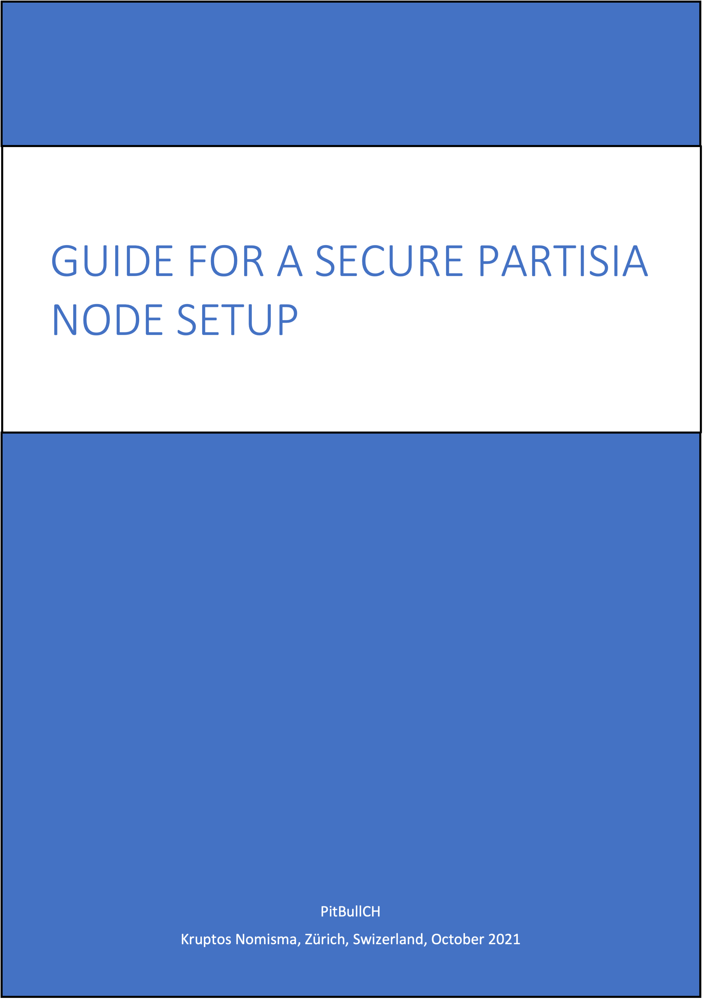


##Introduction

1. This guide assumes a few important things about your VPS:

    - You are using Contabo as your VPS provider – if using another provider there may be subtle differences in terms of what is or is not already installed !
    
    - Instructions intended to be run on a certain platform will be preceded with the following words:
    
        - **On Mac** - this is for running on Mac only
        
        - **On Windows** - this is for running on Windows only
        
        - **On Mac / Windows** - this is for running on Mac or Windows (as appropriate for your situation)
        
        - **On VPS** - this is for running on VPS only
        
    - You will access your VPS over a command-line terminal:
    
        - **On Mac** this would be the default Terminal app, or better, the 3rd-party iTerm2 app
        
        - **On Windows** this would be the default Command Prompt or PowerShell, or perhaps, the 3rd-party Putty app
        
    - You understand that Partisia node logs on the VPS will use the UTC time-zone for timestamps and thus log times may be some hours in front of or behind your own local time – this is because time under UTC never changes through daylight savings time so gives full consistency and continuity
    
    - I will use *yourUsername* and *yourGroupname* in my examples - you will need to replace these appropriately with your own values

2. This guide assumes a few important things about you and Linux:

    - You are using the Linux Ubuntu distro v20.04 (not earlier) – other distros will work, but there may be subtle differences which you will have to work out yourself !
    
    - You may not have too much Unix / Linux experience and you may find some part of this guide a little daunting, but you are NOT afraid to make mistakes and start all over again, and you are NOT afraid to ask questions

    - You should ideally be familiar with one of the usual Unix / Linux command-line editors – I have used *nano* in all examples as it is more intuitive and user friendly, but please feel free to use *vi* if you are more comfortable with that

3. A few important words on security:

    - Store your most critical & private items relating to a blockchain node securely & safely – preferably in a password manager (1Password, Bitwarden, KeePassXC all recommended) – means wallet private keys, login passwords (root and non-root) and SSH keys:
    
        - Store with them your node wallet address & VPS IP address because you will need these - keeping them together makes it easier later
        
        - Store the emergency VPS VNC IP address, username, and password from your VPS provider – you may need them if things go wrong

    - SSH is critical for the security of your VPS - do not skip the setup of this

4. One final thing: although I am experienced on node setups, I do not consider myself an expert – there are thousands of people with more clue than I, and probably similar Partisia node setup guides which are much more comprehensive than this – but this one does the job for me ;-)

Intro over – now let us get down to the good stuff, and in the words of the late, great Douglas Adams: **Don’t Panic !**


##Sign Testnet Agreement

1. Signing the Testnet Agreemnet is a pre-requisite to getting access to the Partisia GitLab repository: without this the node cannot function - so DM *@bryanpartisia* in Discord with the following information and asking for the Testnet Agreement:

   - **Full Name** as stated on the official ID that you used for KYC
   
   - **Email Address** that you used for KYC
   
   - **Residential Address** that you used for KYC

2. You will receive the Testnet Agreement via the *HelloSign* facility - the email will be from Partisia Blockchain (*noreply@mail.hellosign.com*) - review this carefully and sign it, it will be send back to Partisia automatically. The email looks like this:

    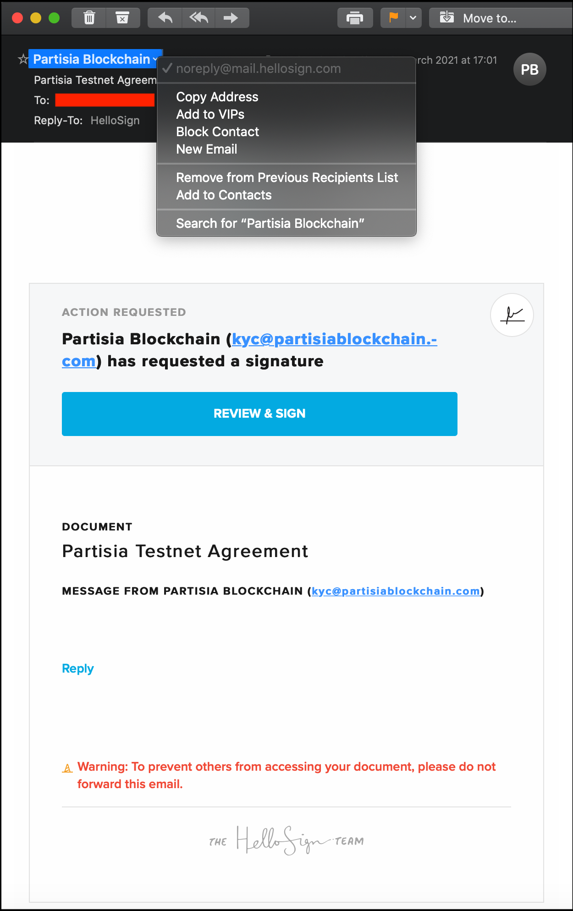

3. You will then receive via the *HelloSign* facility a copy of the signed agreement - again the email will be from HelloSign (*noreply@mail.hellosign.com*) - make sure to story this safely. The email looks like this:

    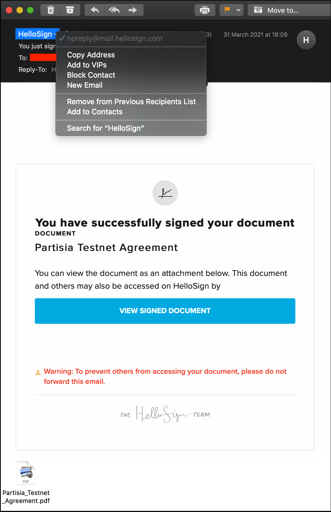


##Node Operator Survey

1. Within a day or two of the above, you will receive via email an invite from *Peter Frandsen* to undertake a Node Operator Survey - the email will be from Node Vetting (*partisia-xxxxxxxxx@survey.au.dk* - where *xxxxxxxxx* is a random number) and this survey is critical as it is used to inform Partisia regarding your public addresses & keys). The email looks like this:

    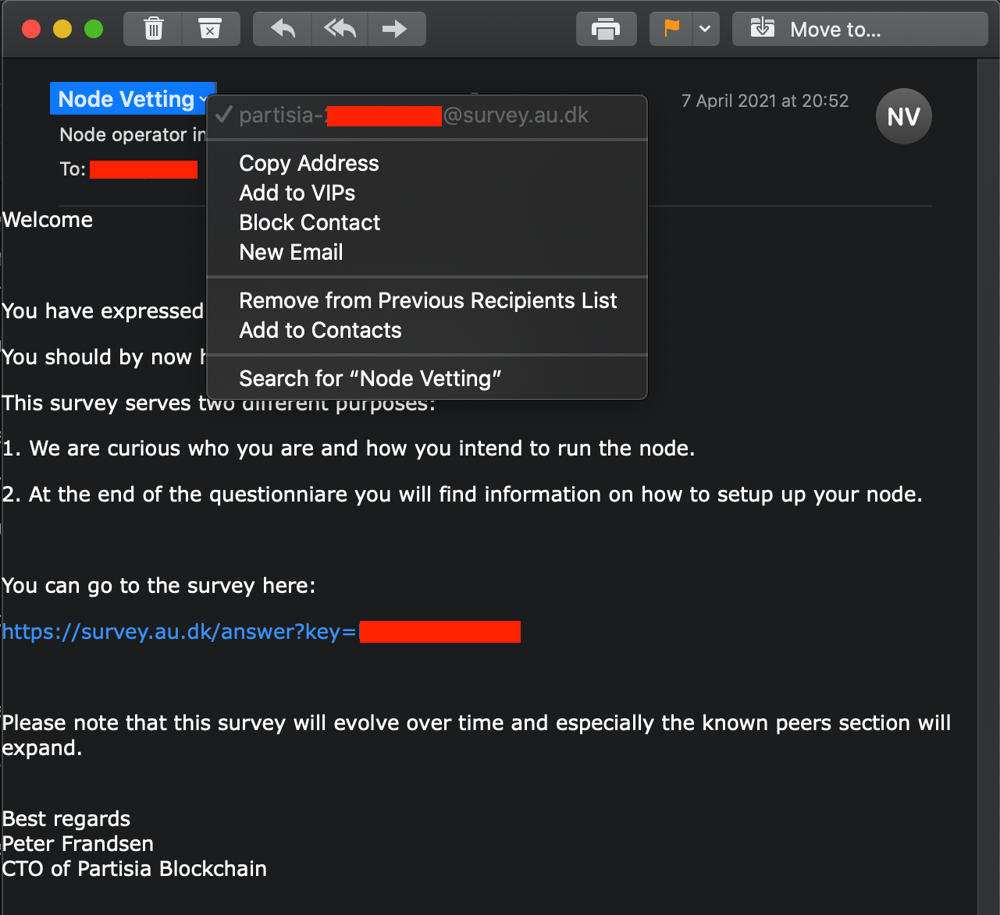

    *Note: the 12-character Survey Key in the email is unique to you, and must not be shared with others - this is critical as any leakage could result in your node being compromised*


##Node Operator Survey - Page 1

1. For the first page of the Survey you only need to fill in the USD value of your Partisia investment, and indicate your level of experise with respect to operating blockchain node:

    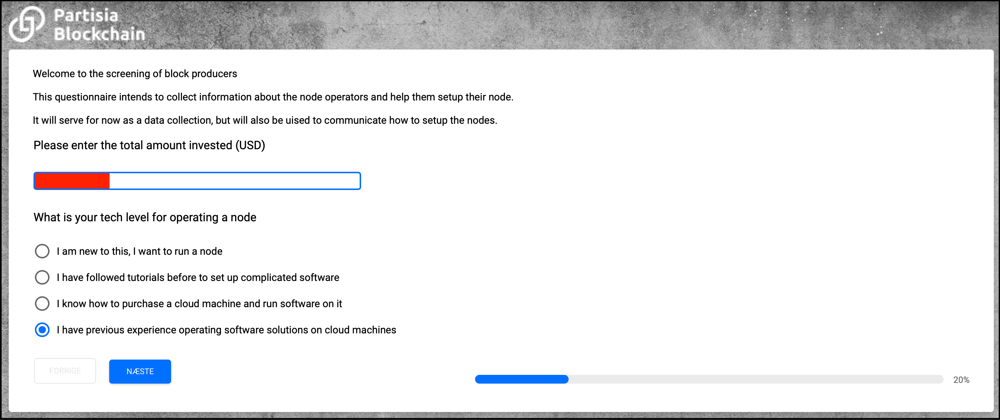

2. Hit *naeste* (next) to continue...

    *Note: Do not be too worried about your level of technical expertise - as long as you have the aptitude and willingness to learn, the Discord-based Node Operator community will be there to help you !*


##Node Operator Survey - Page 2

1. For the second page of the Survey I would advise to answer the same as below, other than adjusting your answer for the second question depending on your own circumstances:

    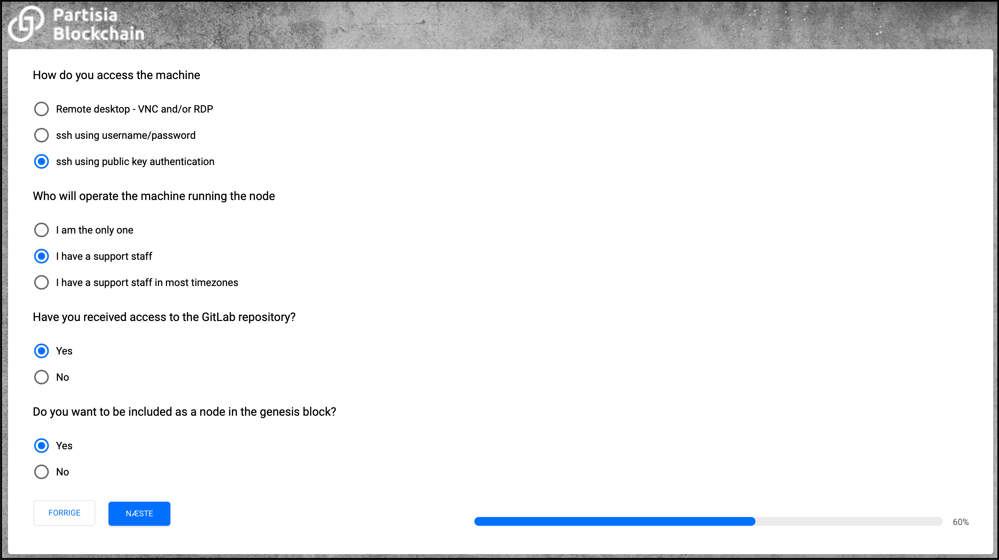

2. Hit *naeste* (next) to continue...
    

##Generate Keys & Addresses

1. Before filling in the next page, in another browser window go the key generator website to generate the various required sets of keys & addresses:

    [https://dashboard.partisiablockchain.com/keygen]()

2. It will look like this (FYI the keys you see here were discarded, they were never used):
    
    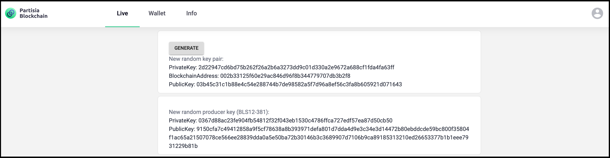

    - There are two sections:

        - **Upper section** comprises a private / public keypair plus the associated blockchain address
        
        - **Lower section** comprises just a BLS Producer private / public keypair

    - Each time you hit the *Generate* button, it generates new entries in both sections. Note however that the upper and lower sections are completely independent of each other, so you could take the entries from one of the sections now, hit *Generate* as many times as you like then take the entries from the other section - and that is perfectly fine !
    
3. In total you need three sets of entries from the upper section, and one from the lower section - as follows:

    - For the first set (from the **upper section**):
    
        - If you are still confident that the keypair / address from your KYC / Sale keygen session are secure and valid then you can use these...
           
        - Otherwise generate now a new set (in this case, you will need to inform *@bryanpartisia* before TGE about the new blockchain address)

        - Regardless: you have a **KYC / Sale private key** (key #1), **KYC / Sale public key** (key #2), and **KYC / Sale blockchain address** (address #3)
        
    - Then for the second set (from the **upper section**):

        - You could use the keypair / address from your Test-Net Baker node if you have them (though I would advise to keep those purely for Test-net activities)...

        - Otherwise generate now a new set

        - Regardless: you have a **Block Producer private key** (key #4), **Block Producer public key** (key #5), and **Block Producer blockchain address** (address #6)
    
    - Then for the third set (from the **upper section**):

        - You probably don't already have any existing ones to use for this, so just generate a new set

        - You now have a **Node Operator private key** (key #7), **Node Operator public key** (key #8), and **Node Operator blockchain address** (address #9)

    - Finally for the fourth set (from the **lower section**):

        - You don't already have any existing ones to use for this, so just generate a new set

        - You now have a **BLS Producer private key** (key #10) and **BLS Producer public key** (key #11)
    
    - Make sure you keep all these safely and securely in your password manager or whatever you use for safe storage of your crypto keys

    - As FYI:
    
        - Private keys (key #1, #4, #7) are all 64 hex characters long
        
        - Public keys (key #2, #5, #8) are 66 hex characters long
        
        - Blockchain (address #3, #7, #9) addresses are 42 hex characters long
        
        - BLS Producer private keys (key #10) are 64 hex characters long
        
        - BLS Producer public keys (key #11) are 192 hex characters long


##Node Operator Survey - Page 3

1. Now fill in page 3 of the Node Operator Survey as shown below, using information from the previous section:

    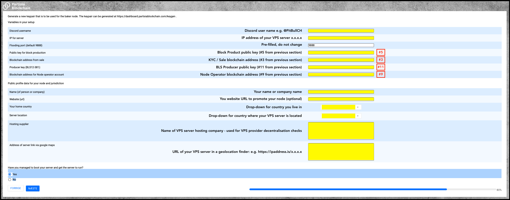

2. Hit *naeste* (next) to continue...


##Node Operator Survey - Page 4
     
1. Nothing to do here other than hit *afslut* (finish) to submit the Node Operator Survey   

    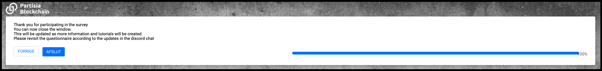

2. Note that you can re-visit this survey and updates entries - for example if you need to change your VPS server IP address, website URL etc


##Generate Ethereum Endpoint

1. An Ethereum Endpoint is needed to facilitate BYOC token exchange with the Ethereum blockchain - in this case a *Ropsten* Test-net endpoint is needed (an Ethereum Main-net endpoint will be needed for PBC Main-net when that is ready to go live)

2. There are several companies that offer this, all for free within certain usage limits (which are not expected to be breached with PBC): [Alchemy.com](https://www.alchemy.com/supernode), [Infura.io](https://infura.io/product/ethereum), [Moralis.io](https://moralis.io/speedy-nodes/) or [Zmok.io](https://zmok.io)

3. Infura is probably the most commonly used, and is a simple sign-up (see this [tutorial](https://blog.infura.io/getting-started-with-infura-28e41844cc89/)) - you need to record the https *Ropsten* endpoint details

    - Infura's *Ropsten* endpoint will looks something like the following (where the 32 hex character string is your Infura *project ID*):
    
        *https://ropsten.infura.io/v3/0123456789abcdef9876543210fedcba*
              
    - Make sure also to set up 2FA with your Infura account

4. Sometimes such endpoint providers do have extended outages, so it can be useful to have an account with a second such provider and have their endpoint details recorded so you can swap if needed


##Create Blockchain Directories

1. **On VPS** for best security you should not use *root* as your default user – far better to create a non-root user based on the project name e.g., *partisia* or your own name or nickname - but it should ideally be the same non-root user you used to set up the VPS

2. **On VPS** create the configuration and storage directories needed for the Partisia node, and give them appropriate ownership and permissions:

    ```
    sudo mkdir -p /opt/pbc-betanet/conf /opt/pbc-betanet/storage
    cd /opt
    sudo find ./pbc-betanet -exec chown yourUsername:yourGroupname {} \;
    sudo find ./pbc-betanet -exec chmod go-rwx {} \;
    ```
    
    *Note: remember to appropriately replace yourUsername & yourGroupname in the above*

3. **On VPS** for checking purposes, display the directories - they should look like this:

    ```
    pwd
    ls -ad pbc-betanet
    ls -al pbc-betanet
    ``` 

    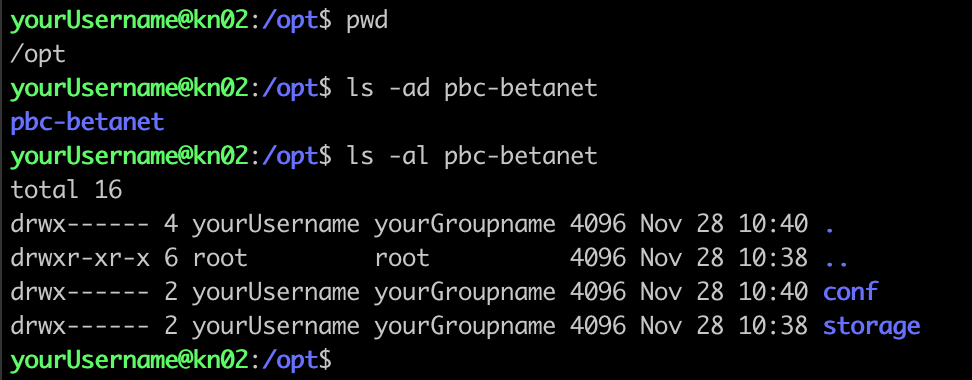

   
##Create Blockchain Genesis File 

1.	**On VPS** the Genesis file defines the initial state of the Partisia blockchain – first create the file:

    ```
    cd /opt/pbc-betanet/conf
    nano genesis.json
    ```
    
2. **On VPS** then add the following content to that file:

    ````
    {
        "chainId": "PARTISIA beta net with accounts",
        "rootAccount": "00047a53311c64239ecdc70ff5bbfd769175b64df0"
    }
    ````  
 
3. **On VPS** give that file appropriate permissions:

    ```
    chmod 600 genesis.json
    ```
       
4. **On VPS** for checking purposes, display that file - it should look like this:

    ```
    pwd
    ls -al genesis.json
    cat genesis.json
    ```

    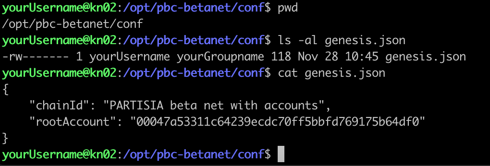


##Create Blockchain Configuration File

1.	**On VPS** the blockchain data needs to be stored locally – first create the file:

    ```
    cd /opt/pbc-betanet/conf
    nano config.json
    ```
    
2. **On VPS** then add the following content to that file:

    ````
    {
      "restPort": 8080,
      "floodingPort": 9888,
      "networkKey": "Block Producer private key (#4)",
      "producerConfig": {
        "accountKey": "Node Operator private key (#7)",
        "finalizationKey": "BLS Producer private key (#10)",
        "ethereumUrl": "ETHEREUM_ROPSTEN_HTTPS_ENDPOINT"
      },
      "knownPeers": [
        "188.180.83.49:9090",
        "188.180.83.49:9190",
        "188.180.83.49:9290",
        "188.180.83.49:9390",
        "174.138.2.217:9888",
        "172.93.110.125:9888",
        "107.189.1.171:9888",
        "176.78.42.5:9888"
      ]
    }
    ````  

3. **On VPS** referring back to the *Generate Keys & Addresses* section:

    - Replace *Block Producer private key (#4)* in this file with your actual hex key *Block Producer private key* (key #4)
    
    - Replace *Node Operator private key (#7)* in this file with your actual hex key *Node Operator private key* (key #7)
    
    - Replace *BLS Producer private key (#10)* in this file with your actual hex jey *BLS Producer private key* (key #10)

4. **On VPS** referring back to the *Generate Ethereum Endpoint* section:

    - Replace *ETHEREUM_ROPSTEN_HTTPS_ENDPOINT* in this file with your actual Ropsten URL (starying *https://ropsten...*)
   
5. **On VPS** give that file appropriate permissions:

    ```
    chmod 600 config.json
    ```    
    
6. **On VPS** for checking purposes, display that file - it should look like this:

    ```
    pwd
    ls -al config.json
    cat config.json
    ```

    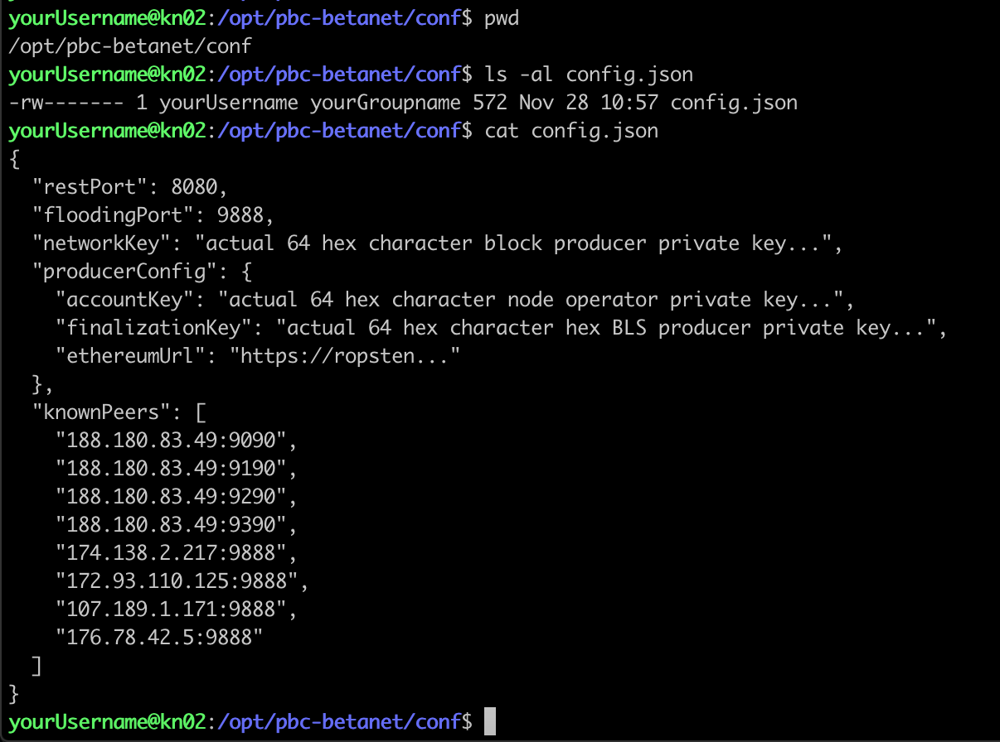
       
   
##Create Docker Compose File

1. **On VPS** create a directory for the Partisia Docker file, and create the file:

    ```
    cd
    mkdir partisia
    chmod 700 partisia
    cd partisia
    nano docker-compose.yml
    ```
    
2. On VPS check for your User ID (UID) and Group ID (GID):

    ```
    id
    ```
    Output should be similar to this, which shows UID = 1001, and GID = 1001:
    
    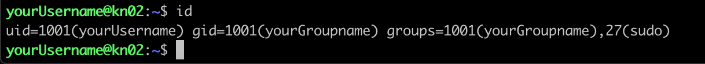    
    
3. **On VPS** then add the following content to that file:

    ````
    pbc-betanet-reader:
      image: registry.gitlab.com/privacyblockchain/demo/betanet-public:latest
      container_name: pbc-betanet-reader
      user: "1001:1001"
      restart: always
      expose:
        - "8080"
      ports:
        - "9888-9897:9888-9897"
      command: [ "/conf/config.json", "/conf/genesis.json", "/storage/" ]
      volumes:
        - /opt/pbc-betanet/conf:/conf
        - /opt/pbc-betanet/storage:/storage
      environment:
        JAVA_TOOL_OPTIONS: "-Xmx2G"
    ````
    
    *Note: remember to appropriately replace UID 1001 and GID 1001 in the above*
    
4. **On VPS** give that file appropriate permissions:

    ```
    chmod 600 docker-compose.yml
    ```    
    
5. **On VPS** for checking purposes, display that file - it should look like this:   

    ```
    pwd
    ls -al docker-compose.yml
    cat docker-compose.yml
    ```
    
    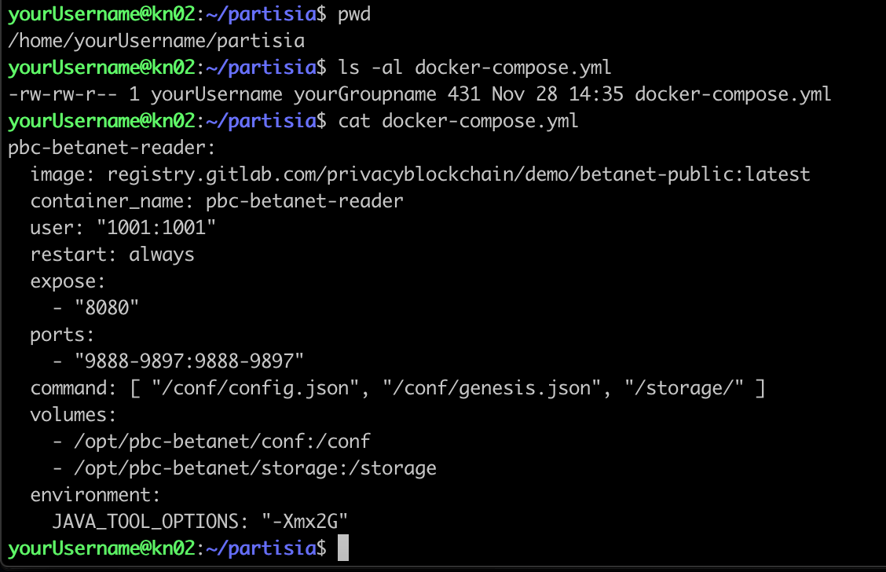
    
   
 
##Enable Partisia Network Ports

1.	**On VPS** allow the ports for Partisia (9888 - 9897) and check the firewall status:

    ```
    sudo ufw allow 9888:9897/tcp
    sudo ufw reload
    ```
    
2. **On VPS** for checking purposes, display the firewall status - it should look like this:   

    ```
    sudo ufw status
    ```

    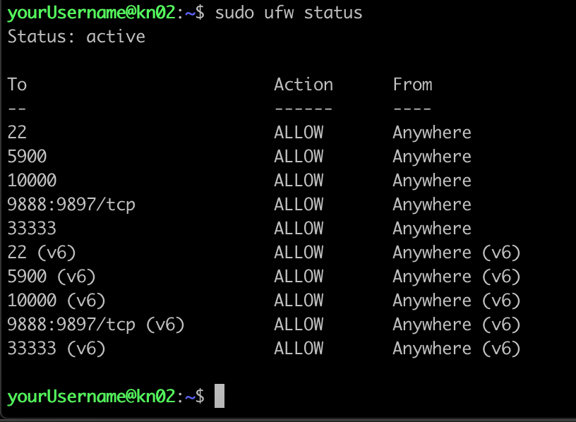


##Perform Docker Login

1.	**On Mac / Windows** if you did not set up 2FA for GitLab access when you registered on GitLab you can skip this step and go to step #2 below – otherwise access the URL below, fill in the personal access token name (e.g., partisia), tick the api box (for full API access), and store the resultant personal access token carefully in your password manager or similar:

    [https://gitlab.com/-/profile/personal_access_tokens]()
    
2.	**On VPS** now perform the Docker login to the GitLab API – you will need to provide your GitLab-registered email address, plus either your GitLab password or (if you did set up 2FA) your personal access token:

    ```
    docker logout
    docker login -u yourEmailAddress registry.gitlab.com
    ```
    
    
##Start Partisia Node

1. **On VPS** first pull the Partisia node image into a Docker container:

    ```
    cd
    cd partisia
    docker-compose pull
    ```
    
    *Note: do this anytime you stop/start the node to ensure you are always using the latest image*
    
2. **On VPS** now start the Partisia node within Docker:

    ```
    docker-compose up -d
    ```
    *Note: the -d argument ensures the container is started in the background, which allows you to disconnect from the VPS without killing the container*


##View Partisia Logs

1. **On VPS** view the Docker logs to see the Partisia node progress

    - On Test-net the container is called pbc-betanet-reader (on Main-net it may be called something different, so expect to adjust this later):

        ```
        docker logs -f pbc-betanet-reader
        ```
    
    - If the node has been running a long time, it can take many minutes to catch up through all the logs - in this case use the *--tail* argument to grab the last e.g. 1000 logs only:

        ```
        docker logs --tail 1000 -f pbc-betanet-reader
        ```
    
2. Refer to Discord for an explanation of what the various logs mean - however at a high level, if there is a regular sequence of Handling / Signing / Executing logs with incrementing block numbers, this is generally a sign the node is working correctly

    
##Stop Partisia Node

1. **On VPS** whenever needed, stop the Partisia node and remove the image from Docker:

    ```
    docker-compose down
    ```


##Restart Partisia Node (optional)

1. **On VPS** this sequence pulls a fresh Partisia image (only if there is one) and performs a fresh start - this should be the normal operational restart sequence as it does not cause any downtime unless there is a fresh Partisia image:

    ```
    docker-compose pull
    docker-compose up -d
    ```
    
2. **On VPS** this sequence performs a hard stop (stops & removes the Partisia image) then pulls a fresh Partisia image and performs a fresh start - this can be a good procedure to follow after a VPS reboot:

    ```
    docker-compose down
    docker-compose pull
    docker-compose up -d
    ```
    
3. **On VPS** this sequence performs a simple stop & start without removing the Partisia image - if any changes made to the *docker-compose.yml* file after stopping, these *will* be used during the start:

    ```
    docker-compose stop
    docker-compose start
    ```
    
4. **On VPS** this sequence performs a simple restart of the Partisia image - if any changes made to the *docker-compose.yml* file before restarting, these will *not* be used during the restart:

    ```
    docker-compose restart
    ```
    
5. **On VPS** although not strictly a restart sequence *per se*; this sequence performs a pause, and when needed, an unpause (i.e. resumption) of the Partisia image - this can be useful when trying to diagnose unrelated issues with the VPS:
    
    ```
    docker-compose pause
    docker-compose unpause
    ```
    

##Enable Automatic Docker Restarts

1. On VPS ensure that Docker always restarts automatically after any sort of planned or unplanned VPS outage:
    
    ```
    sudo systemctl enable docker
    sudo systemctl daemon-reload
    ```
    

## Configure Test-Net Updates

1. **On VPS** the current requirement *on Test-net only* is to perform a Partisia node restart every 30 minutes because of the frequent updates being deployed to Test-net - this allows the node to pick up those updates quickly

2. **On VPS** create an update script file:

    ```
    cd
    cd partisia
    nano update_node.sh
    ```
    
3. **On VPS** then add the following content to that script file:

    ```
    #!/bin/bash
    
    DATETIME=`/usr/bin/date -u`
    echo "$DATETIME"

    cd /home/yourUsername/partisia

    /usr/local/bin/docker-compose pull
    /usr/local/bin/docker-compose up -d
    ```
    
    *Note: remember to appropriately replace yourUsername in the above*
 
4. **On VPS** give that script file appropriate permissions:

    ```
    cd
    cd partisia
    chmod 700 update_node.sh
    ```

5. **On VPS** run that script manually, ensuring it executes as expected without any errors (do not go on to next step until all errors are fixed):

    ```
    cd
    cd partisia
    ./update_node.sh
    ```
    
    *Note: errors with this script are usually down to using the wrong directory for the cd command, or some issue with the docker-compose command not being in the expected location*
    
6. **On VPS** now create a *crontab* entry:

    ```
    crontab -e
    ```
    
7. **On VPS** then add the following content to that file to run that script every 30 minutes, piping standard output and errors to a log file in the same directory:

    ```
    */30 * * * * /home/yourUsername/partisia/update_node.sh > /home/yourUsername/partisia/update_node.log 2>&1
    ```
    
    *Note: remember to appropriately replace yourUsername twice in the above*

8. **On VPS** once that script has run, view the update logs using:

    ```
    cd
    cd partisia
    cat update_node.log
    ```
    
    or
    
    ```
    cat /home/yourUsername/partisia/update_node.log
    ```
    
    *Note: remember to appropriately replace yourUsername in the above*

    
## Suggestions ?

Any errors or suggestions for content to be added - please email me at *pitbullch@pitbullch.com*, or DM me on Discord or Telegram as *@PitBullCH*.

