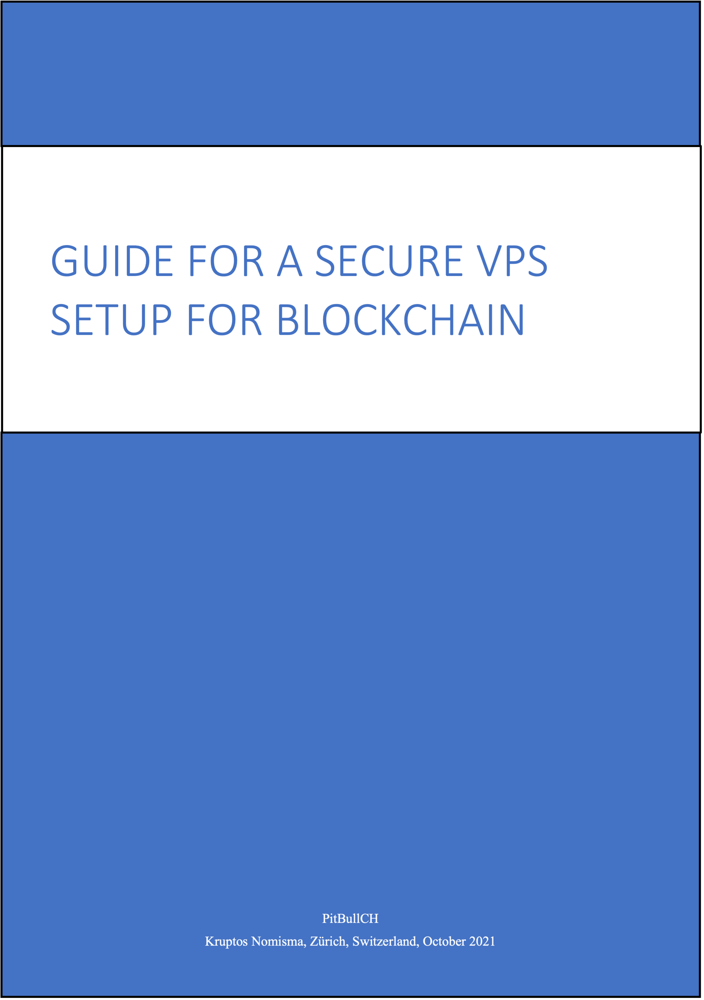
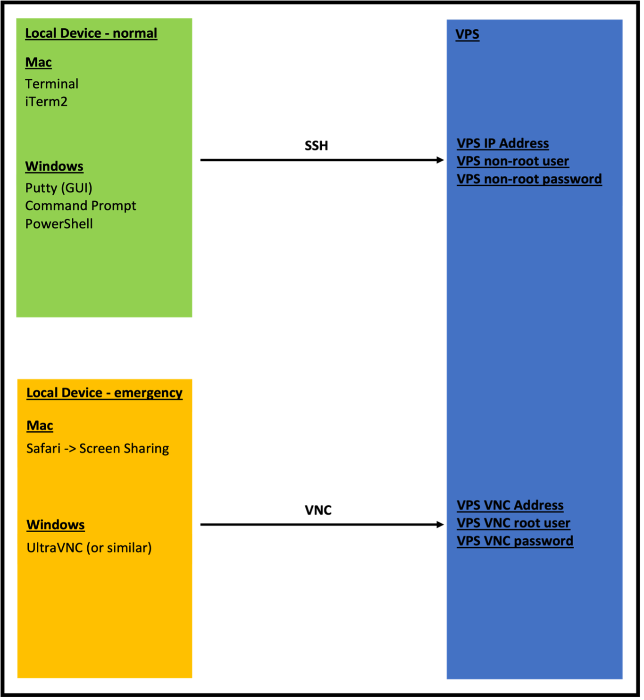
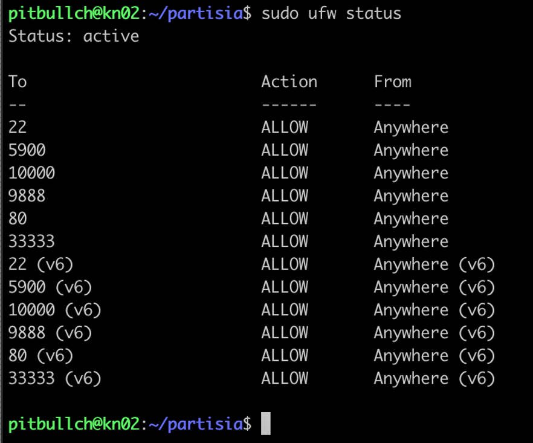
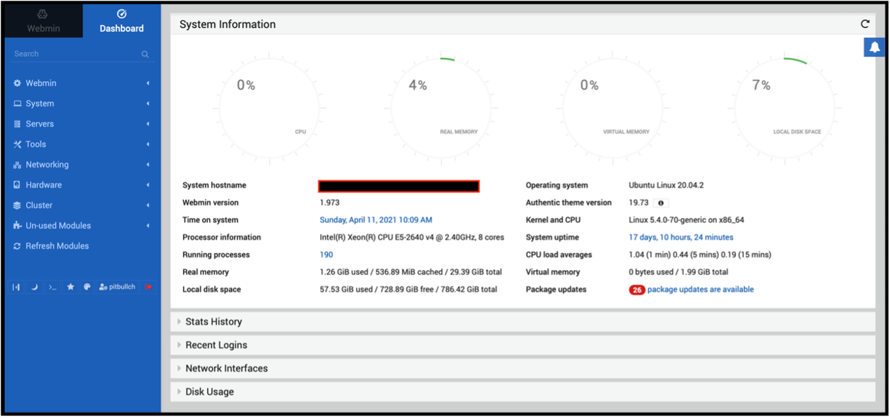
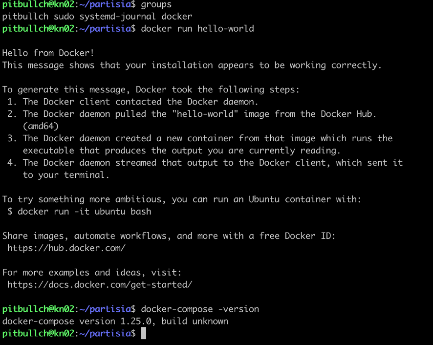
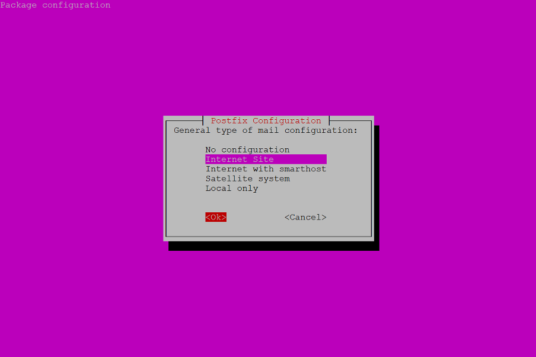
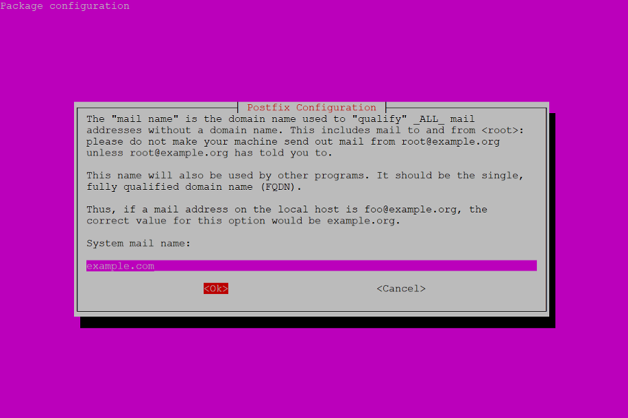
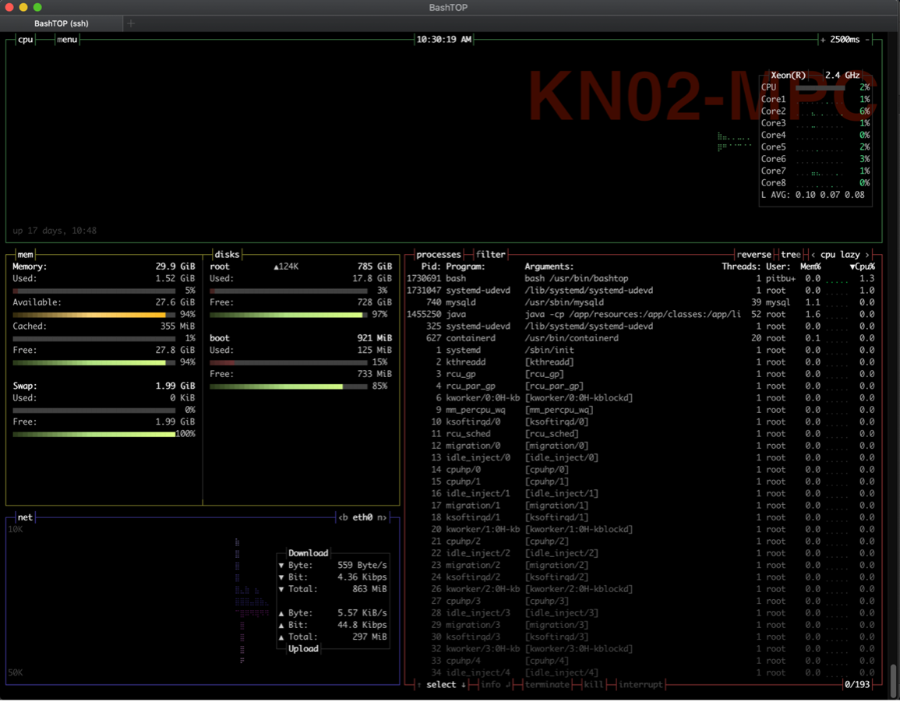
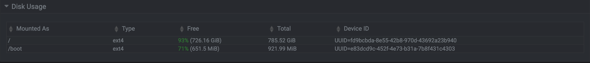
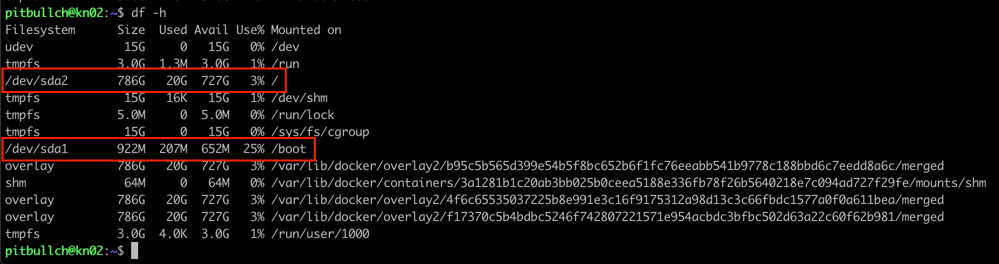

#Kruptos Nomisma presents...




##Introduction

1. First things first: I want to thank @jayjaynl for his original Secure LTO Network Node Setup Guide – my document is strongly based on his excellent original, with edits and additions of my own – you can find his original here:

    [https://medium.com/@jayjaynl/extensive-guide-to-a-secure-lto-network-public-node-setup-33053a4370c8]()

2. This guide assumes a few important things about your VPS:

    - You are using Contabo as your VPS provider – if using another provider there may be subtle differences in terms of what is or is not already installed !
    
    - Instructions intended to be run on a certain platform will be preceded with the following words:
    
        - **On Mac** - this is for running on Mac only
        
        - **On Windows** - this is for running on Windows only
        
        - **On Mac/Windows** - this is for running on Mac or Windows (as appropriate for your situation)
        
        - **On VPS** - this is for running on VPS only
        
    - You will access your VPS over a command-line terminal:
    
        - **On Mac** this would be the default Terminal app, or better, the 3rd-party iTerm2 app
        
        - **On Windows** this would be the default Command Prompt or PowerShell, or perhaps, the 3rd-party Putty app
        
    - For VPS recovery purposes you will need a VNC client – best to have that ready to go:
    
        - **On Mac** you can enter the VNC URL into a browser and it will bring up the built-in Screen Sharing app
        
        - **On Windows** there is no built-in VNC client, get the 3rd-party UltraVNC app from [https://www.uvnc.com]()

3. This guide assumes a few important things about you and Linux:

    - You are using the Linux Ubuntu distro v20.04 (not earlier) – other distros will work, but there may be subtle differences which you will have to work out yourself !
    
    - You may not have too much Unix / Linux experience and you may find some part of this guide a little daunting, but you are NOT afraid to make mistakes and start all over again, and you are NOT afraid to ask questions
    
    - You should ideally be familiar with one of the usual Unix / Linux command-line editors – I have used *nano* in all examples as it is more intuitive and user friendly, but please feel free to use *vi* if you are more comfortable with that

4. A few important words on security:

    - Store your most critical & private items relating to a blockchain node securely & safely – preferably in a password manager (1Password, Bitwarden, KeePassXC all recommended) – means wallet private keys, login passwords (root and non-root) and SSH keys:
    
        - Store with them your node wallet address & VPS IP address because you will need these - keeping them together makes it easier later
        
        - Store the emergency VPS VNC IP address, username, and password from your VPS provider – you may need them if things go wrong
        
    - SSH is critical for the security of your VPS - do not skip the setup of this

5. One final thing: although I am experienced on VPS setups, I do not consider myself an expert – there are thousands of people with more clue than I, and hundreds of similar VPS setup guides which are much more comprehensive than this – but this one does the job for me ;-)

Intro over – now let us get down to the good stuff, and in the words of the late, great Douglas Adams: **Don’t Panic !**


##Network Diagram

1. Below attempts to show the relationship between your local device (Mac/Windows PC etc) and your VPS, what you will use to connect between them during normal everyday usage, and what to use during emergency usage when you have locked yourself out:

    


##Set New Root Password

1. **On Mac/Windows** for best security and safety, connect to your VPS (I will use VPS IP address *192.168.0.50* in my examples) and then change the VPS provider-assigned root password - first make the connection:

    ```
    ssh 192.168.0.50 -l root
    ```

    **On VPS** *on very rare occasions* the VPS provider does not install the SSH server by default and the above ssh command will fail - means before you connect via SSH you need to connect to the VPS via VNC, then install the SSH server:

    ```
    apt update
    apt install openssh-server
    ```

2. **On VPS** then change the root password:

    ```
    passwd root
    ```


##Open Emergency Window (Critical !!!)

1. **On Mac/Windows** now login to the VPS again *in a new (second) connection* using the new password to ensure that it is working - this avoids the situation where you change the password, close your connection, open a new one only to find you screwed up the password change somehow

2.	**On Mac/Windows** remember to *open a new second connection to the VPS after every reboot*

3.	**On Mac/Windows** if you ever get locked out of your VPS and don’t have a second connection already open, you will need to connect to your VPS over VNC - refer to your VPS provider's VNC documentation for this


##Set Up Non-Root User

1. **On VPS** for best security you should not use *root* as your default user – far better to create a non-root user based on the project name e.g., *partisia* or your own name or nickname (I will use *yourUsername* in my examples):

    ```
    adduser yourUsername
    ```

2. **On VPS** add your non-root user to the sudo users list (so you can later execute commands with root privileges via sudo), and allow it to access system logs:

    ```
    usermod -aG sudo yourUsername
    usermod -aG systemd-journal yourUsername
    ```

3. **On VPS** now logout and reconnect, then check that the above commands worked - you should see those two groups included:

    ```
    groups
    ```


##Set Up SSH For Secure Connections

**EITHER**

1. **For Mac**

    - **On Mac** (in *Terminal* or *iTerm2*) create your SSH public / private key-pair – accept all the defaults, and enter a secure passphrase:

        ```
        cd
        ssh-keygen
        ```
   
    - **On Mac** display your key file, and copy it to the VPS:

        ```
        cd
        cd .ssh
        cat id_rsa.pub
        ssh-copy-id yourUsername@192.168.0.50
        ```
      
    - **On VPS** check that your key file is in place and display it:

        ```
        cd
        cd .ssh
        ls -al authorized_keys
        cat authorized_keys
        ```
     
    - **On Mac** and **on VPS** if you look at the two files, the content should be indentical.

**OR**

1. **For Windows**

    - **On Windows** (in *Command Prompt* or *PowerShell*), create your SSH public / private key-pair – accept all the defaults, and enter a secure passphrase:

        ```
        cd /d c:%HOMEPATH%
        ssh-keygen
        ```

    - **On VPS** create your .ssh directory:

        ```
        cd
        mkdir .ssh
        chmod 700 .ssh
        ```
   
    - **On Windows** display your key file, and copy it to the VPS:

        ```
        cd /d c:%HOMEPATH%
        type id_rsa.pub
        scp id_rsa.pub yourUsername@192.168.0.50:/home/yourUsername/.ssh/authorized_keys
        ```
      
    - **On VPS** check that your key file is in place and display it:

        ```
        cd
        cd .ssh
        ls -al authorized_keys
        cat authorized_keys
        ```
      
    - **On Windows** and **on VPS** if you look at the two files, the content should be indentical. 

2. **On Mac/Windows** now connect to your VPS via SSH - this will need your new SSH passphrase:

    ```
    ssh yourUsername@192.168.0.50
    ```
   
3. **On VPS** change configuration to disable normal password logins so that only SSH logins are allowed, and also change the SSH port for a little extra security (the port number should be in the range 1025-65535 – I will use *33333* in my examples) - first back up the SSH config file:

    ```
    sudo cp /etc/ssh/sshd_config /etc/ssh/sshd_config.myback
    ```
   
4. **On VPS** edit the SSH config file:

    ```
    sudo nano /etc/ssh/sshd_config
    ```

5. **On VPS** find and change the settings below in that file - if there is a comment character (#) in front of one, you need to remove it for the setting to be able to take effect:

    ```
    Port 33333
    PermitRootLogin no
    MaxAuthTries 3
    PubkeyAuthentication yes
    AuthorizedKeysFile .ssh/authorized_keys
    PasswordAuthentication no
    PermitEmptyPasswords no
    AllowAgentForwarding no
    AllowTcpForwarding no
    X11Forwarding no
    ```

6. **On VPS** test the SSH configuration file for errors – fix any that are shown, continue testing and fixing until all clear – once it reports nothing back, all is good:

    ```
    sudo sshd -t
    ```

7. **On VPS** restart the SSH service for the new configuration to take effect:

    ```
    sudo systemctl restart ssh
    sudo systemctl status ssh
    ```
    
    **On VPS** hit ++q++ or ++ctrl+c++ to terminate the above command (if needed)

8. **On Mac/Windows** now connect again to your VPS via SSH - this time it will need both the new port number and your SSH passphrase:

    ```
    ssh -p 33333 yourUsername@192.168.0.50
    ```
    
9. **On VPS** *only If this SSH configuration goes wrong* then copy your backup config file back into place and restart the SSH service again:

    ```
    sudo cp /etc/ssh/sshd_config.myback /etc/ssh/sshd_config
    sudo systemctl restart ssh
    ```
    
    **On VPS** hit ++q++ or ++ctrl+c++ to terminate the above command (if needed)
   
   
##Update Ubuntu

1. **On VPS** update the master package list, then upgrade to all latest listed packages, reboot, and re-connect to your VPS:

    ```
    sudo apt update
    sudo apt upgrade
    sudo reboot
    ```
   
   
##Install NTP (Network Time Protocol)

1. **On VPS** blockchain nodes are usually incredibly sensitive to time drift so this is critical to configure – first install the NTP package itself (you may find it is already installed):

    ```
    sudo apt update
    sudo apt install ntp ntpdate
    ```
   
2. **On VPS** then stop the NTP service, point it towards a valid NTP server, and restart the service:

    ```
    sudo service ntp stop
    sudo ntpdate pool.ntp.org
    sudo service ntp start
    sudo systemctl status ntp
    ```

    **On VPS** hit ++q++ or ++ctrl+c++ to terminate the above command (if needed)
   
   
##Install Fail2Ban

1. **On VPS** Fail2Ban is used to block repeated incoming connection attempts, which are usually a sign of a malicious attack - first install the Fail2Ban package itself:

    ```
    sudo apt update
    sudo apt install fail2ban
    sudo cp /etc/fail2ban/jail.conf /etc/fail2ban/jail.local
    ```
   
2. **On VPS** then back up the Fail2Ban config file:

    ```
    sudo cp /etc/fail2ban/jail.local /etc/fail2ban/jail.myback
    ```
   
3. **On VPS** then edit the Fail2Ban config file:

    ```
    sudo nano /etc/fail2ban/jail.local
    ```
   
4. **On VPS** replace every line containing “*port = ssh*” with “*port = 33333*” (the port number you defined for SSH earlier) - normally there are 3 such entries:

    ```
    [sshd]
    port    = 33333
    logpath = %(sshd_log)s
    backend = %(sshd_backend)s
   
    [dropbear]
    Port     = 33333
    logpath  = %(dropbear_log)s
    backend  = %(dropbear_backend)s
   
    [selinux-ssh]
    port     = 33333
    logpath  = %(auditd_log)s
    ```
   
5. **On VPS** then start the Fail2Ban service for this to actually take effect:

    ```
    sudo systemctl enable fail2ban
    sudo service fail2ban start
    sudo systemctl status fail2ban
    ```
    
    **On VPS** hit ++q++ or ++ctrl+c++ to terminate the above command (if needed)

6. **On VPS** *only If this Fail2Ban configuration goes wrong* then copy your backup config file back into place and stop the Fail2Ban service:

    ```
    sudo cp /etc/fail2ban/jail.myback /etc/fail2ban/jail.local
    sudo service fail2ban stop
    sudo systemctl status fail2ban
    ```

    **On VPS** hit ++q++ or ++ctrl+c++ to terminate the above command (if needed)


##Set Up The Firewall

1. **On VPS** the Uncomplicated Firewall (UFW) is used to stop / block incoming potentially malicious traffic - as a baseline block all the incoming ports, then allow traffic on specific ports for SSH (ports 22, 33333), VNC (port 5900), and Webmin (port 10000) connections:

    ```
    sudo ufw disable
    sudo ufw default deny incoming
    sudo ufw default allow outgoing
    sudo ufw allow 22
    sudo ufw allow 33333
    sudo ufw allow 5900
    sudo ufw allow 10000
    ```
   
2. **On VPS** re-enable the firewall and firewall logging and check the firewall status:

    ```
    sudo ufw logging on
    sudo ufw enable
    sudo ufw status
    ```
   
3. **On VPS** my output from that last command looks like this:

    

    *Note: you can ignore port 80 in the above for now - this is because I have that port open for something else*
   
   
##Install Webmin

1. **On VPS** Webmin is an excellent web-based administration and monitoring tool - first install the packages and certificates required for installing Webmin, and add the Webmin repository:

    ```
    sudo apt update 
    sudo apt install gpg-agent apt-transport-https software-properties-common
    wget -qO - http://www.webmin.com/jcameron-key.asc | sudo apt-key add
    ```
   
    *Note: in the "wget" command above, that is a capital letter O, not a zero*

    ```
    sudo add-apt-repository "deb [arch=amd64] http://download.webmin.com/download/repository sarge contrib"
    ```
   
2. **On VPS** update the package repository, then install the Webmin package itself, and check it is running (it normally starts automatically after installation):

    ```
    sudo apt update
    sudo apt install webmin
    sudo systemctl status webmin
    ```
   
    **On VPS** hit ++ctrl+c++ to terminate the above command (if needed)

    **On VPS** *on Ubuntu 21.04 onwards* Webmin is started a different way:

    ```
    sudo /etc/init.d/webmin restart
    ```
   
3. **On Mac/Windows** to access Webmin, open your browser and enter this URL (*yourHost.yourProvider.com* is your VPS' fully-qualified domain name, *10000* is the default Webmin port):

    [https://yourHostname.yourProvider.com:10000]()

    Or you can use the VPS IP address instead:

    [https:// 192.168.0.50:10000]()

4. **On Mac/Windows** login with your non-root user and password – if you need some help with Webmin, you can find that here:

    [https://www.webmin.com/docs.html]()

    [https://www.webmin.com/faq.html]()
   
5. **On Mac/Windows** as you can see below, I need to do some updating !

    
   
   
##Install Docker & Docker-Compose

1. **On VPS** Docker is a container technology used to run software such as the Partisia node in a secure pre-configured environment – first install the packages and certificates required for installing Docker, and add the Docker repository:

    ```
    sudo apt install apt-transport-https ca-certificates curl gnupg lsb-release
    curl -fsSL https://download.docker.com/linux/ubuntu/gpg | sudo gpg --dearmor -o /usr/share/keyrings/docker-archive-keyring.gpg
    echo "deb [arch=amd64 signed-by=/usr/share/keyrings/docker-archive-keyring.gpg] https://download.docker.com/linux/ubuntu $(lsb_release -cs) stable" | sudo tee /etc/apt/sources.list.d/docker.list  > /dev/null
    ```
   
2. **On VPS** update the package repository, then install the Docker package itself:

    ```
    sudo apt update
    sudo apt install docker-ce docker-ce-cli containerd.io
    ```
   
3. **On VPS** install the Docker Compose package, then ensure it is executable, and reachable from the normal directory:

    ```
    sudo curl -L "https://github.com/docker/compose/releases/download/1.29.0/docker-compose-$(uname -s)-$(uname -m)" -o /usr/local/bin/docker-compose
    sudo chmod +x /usr/local/bin/docker-compose
    sudo ln -s /usr/local/bin/docker-compose /usr/bin/docker-compose
    ```
   
4. **On VPS** add the docker group (it may already be added - in which case ignore the error), then add your non-root user to that group:

    ```
    sudo groupadd docker
    sudo usermod -aG docker yourUsername
    ```

5. **On VPS** now log out and re-connect to your VPS for the above to take effect, then check your groups and test the docker installations:

    ```
    docker run hello-world
    docker-compose -version
    ```
   
6. **On VPS** my output from those last three commands looks like this:

    
   
   
##Install Mail Utilities

1. **On VPS** it’s potentially very useful to be able to be able to send emails for warnings etc – first install the mailutils package itself:

    ```
    sudo apt update
    sudo apt install mailutils sendmail
    ```

2. **On VPS** with pre-20.xx versions of Ubuntu you will get a pop-up screen asking you to select the General type of mail configuration - select Internet Site and hit Return:

    
   
    You will then be asked to enter your System mail name – just accept the default and hit Return:
   
    
   
3. **On VPS** test the installation by sending a mail - this should result in an email being sent to your email address, the content being that of the */etc/shells* file from your VPS:

    ```
    mail -s "testing my VPS" yourEmailAddress < /etc/shells
    ```

    *Note: some VPS providers do not allow email to be sent in the first 24 hours after a VPS is ordered, or in some cases you must contact the VPS Support team to request to be able to send emails - this is part of their process to stop spammers - means you may need to re-test this depending on your VPS provider*


##Install Bashtop

1. **On VPS** Bashtop is an excellent top alternative for checking system resources – first install the packages and certificates required for installing Bashtop:

    ```
    wget -qO - https://azlux.fr/repo.gpg.key | sudo apt-key add
    ```

    *Note: in the "wget" command above, that is a capital letter O, not a zero*

    ```
    echo "deb http://packages.azlux.fr/debian/ buster main" | sudo tee /etc/apt/sources.list.d/azlux.list
    ```

2. **On VPS** update the package repository, then install the Bashtop package itself and run it:

    ```
    sudo apt update
    sudo apt install bashtop
    bashtop
    ```
   
3. **On VPS** my Bashtop output looks like this:

    
   
   
##Appendix A - VPS Maintenance (Critical !!!)

1. I’m not going to add much here – main thing to do is to ensure your Ubuntu packages are up to date – I would strongly advise you do this on a regular basis, perhaps schedule a regular 30-minute slot every week or two. There are two main ways to do this:

    - **On Mac/Windows** via WebMin on the main dashboard page it will tell you how many packages are out of date, click on that list and it’ll take you to an update screen
    
    - **On VPS** via the command line – you may or may not need to reboot (usually only if there is a kernel update)

2. keep an eye out on your disk space usage, especially if you are renting a VPS with a relatively small SSD. Again there are two main ways to do this:

    - **On Mac/Windows** via WebMin on the main dashboard page at the bottom is the Disk Usage section - I would advice to keep this permanently open so you can always see the current usage - my usage looks like this:       

        
   
    - **On VPS** you will see a more complex output using the following:

        ```
        df -h
        ```
   
    - **On VPS** Depending on the disk partition layout you have, you need to watch out for "/" (the root filesystem) and possibly also "/boot" (if you only have that as a separate partition) - my usage looks like this:

        
   

##Appendix B - VPS Control From A Secondary Device

If you want to be able to control your VPS from a secondary device (Mac or Windows PC) in case of issues with your primary device, or maybe because you are travelling with a secondary device, you first need to set up access for that device.

Now assuming you already set up access from your primary Mac/Windows desktop #1, and because you might be travelling, you also want to set up access from your secondary Mac/Windows laptop #2.

1. **On Mac/Windows #1** as a safety precaution, open 2 connections from your primary device to your VPS

2. **On Mac/Windows #2** generate the new key pair (see section 6 of this guide)

3. **On Mac/Windows #2** find the newly generated public key file - it should be in the *.ssh *directory under your home directory, and will be called *id_rsa.pub* 

4. **On Mac/Windows #2** you now need to get the contents of that file from your secondary device to the VPS

    - Easiest way is to copy it to a USB stick on the secondary device, then insert the USB stick into the primary device
    
    - Other options including emailing it to yourself on your primary device, or copying it from the secondary device to a NAS or Dropbox account (if you have one) then copying from the NAS/Dropbox account to the primary device - but the USB stick is easiest

5. **On Mac/Windows #1** find the newly copied public key file and open it in a text editor (*TextEdit* on Mac, *Textpad* or *Wordpad* on Windows), highlight and copy the file contents into your copy/paste buffer (++cmd+c++ on Mac, ++ctrl+c++ on Windows)

6. **On VPS** via one of the connections opened in step #1 (above), edit the *authorized_keys* file:

    ```
    cd
    cd .ssh
    nano authorized_keys
    ```
   
7. **On VPS** go to the end of the file, paste (++cmd+v++ on Mac, ++ctrl+v++ on Windows) your copy/paste buffer contents into the file, write and quit - then review the file to ensure it is correct - you should now see that new line at the end:

    ```
    cat authorized_keys
    ```

8. **On Mac/Windows #2** test a new connection to the VPS and ensure that it works

    ```
    ssh yourUsername2@192.168.0.50
    ```
    
    - Note that you might be using a different username on the secondary device to the one you are using on the primary device - if you are not sure, look at the line you just added to the *authorized_keys* file on the VPS, the last part of the line will be *username2@hostname* where *username2* will be the username on that secondary device - that is what you use in the ssh command


